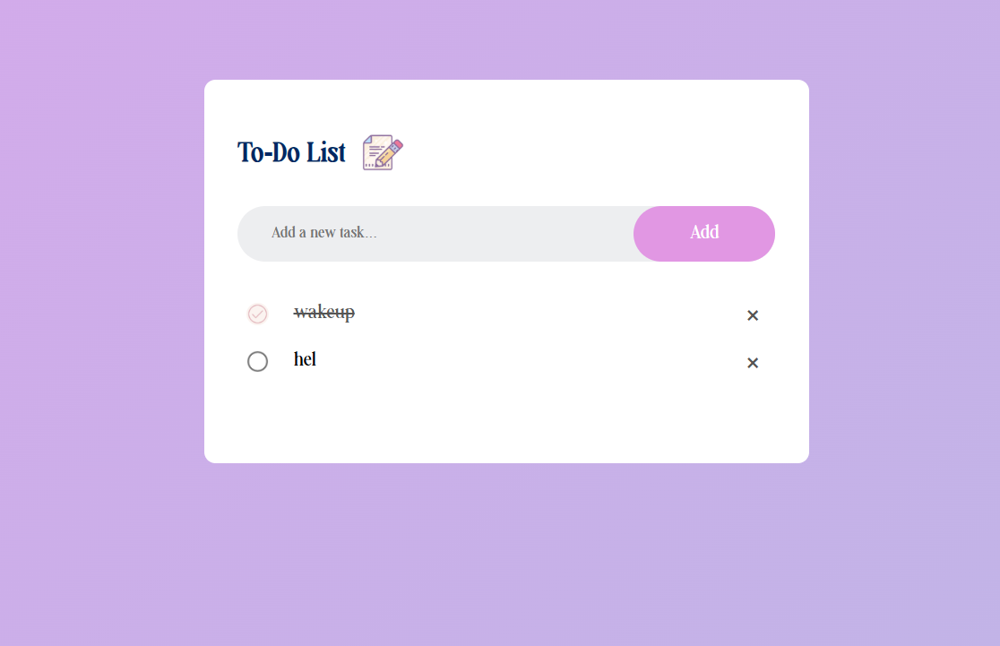

# **To-Do List App**

This is a simple to-do list app I built using HTML, CSS, and JavaScript.  
It lets me add tasks, mark them as completed, and delete them.  
The tasks are saved in LocalStorage, so they stay even after refreshing or closing the browser.

## Features

- Add new tasks  
- Mark tasks as completed  
- Delete tasks  
- Saves everything automatically using LocalStorage  
- Clean and minimal interface

## Preview

## How to Run

Just open `index.html` in any browser.  
No setup or installation needed.

## How It Works

The app saves every task to LocalStorage whenever something changes.  
When the page loads, it reads the saved data and rebuilds the list.

## Live Deployment

https://to-do-app-pi-lemon.vercel.app/

## Why I Built This

I wanted a small project to practice JavaScript and create something useful at the same time. A to-do list felt like the right mix of simple and practical.
